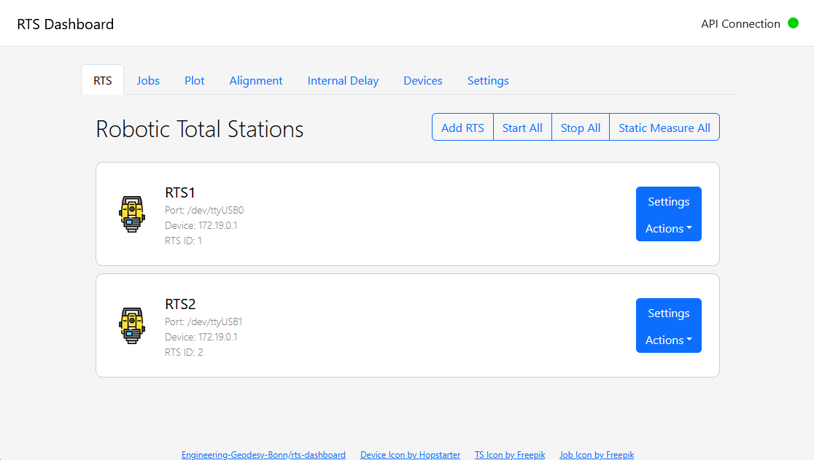

# Robotic Total Station Network

This repository contains the code for the Robotic Total Station Network (RTSN) project. A RTSN is a network of spatially distributed robotic total stations that are tracking the same or multiple moving objects. A RTSN can be used for various applications such as reference trajectory generation in GNSS denied environments or tracking of moving objects in construction sites or industrial environments where a consistent line of sight is not guaranteed using a single total station.



## System Overview

The RTSN system consists of multiple robotic total stations that are connected to a central server. The RTS API is responsible for collecting the data from the total stations, processing the data, managing RTS jobs and providing the tracking information to the clients. The clients can be any device that is connected to the RTS API and can communicate with it. The RTS Worker is the bridge between the total stations and the RTS API. It is responsible for collecting the data from the total stations using serial communcation and sending it to the RTS API using a REST API. The RTS Dashboard can be used to visualize the tracking information and control the total stations.


## Installation

The RTS network consists of multiple components that need to be installed and configured. It is recommended to install the API and the dashboard on a device like a laptop or a server and the worker on a Raspberry Pi that is connected to the total stations. Installation instructions for each component can be found in the respective folders of the components. If you want to install the dashboard and the API on the same device, you can use the docker compose file provided in this repository. The docker compose file will build the images for the API and the dashboard and run them in separate containers. The worker can be installed on a Raspberry Pi or any other device that is connected to the total stations.

Clone the repository and navigate to the root folder:

```bash
git clone https://github.com/Engineering-Geodesy-Bonn/rts-network
cd rts-network
```

Then, build and run the Docker containers using the following command:

```bash
docker-compose up -d
```

This will build the Docker images for the API and dashboard and start the containers. The API will be available at `http://localhost:8000` and the dashboard at `http://localhost:8050`.