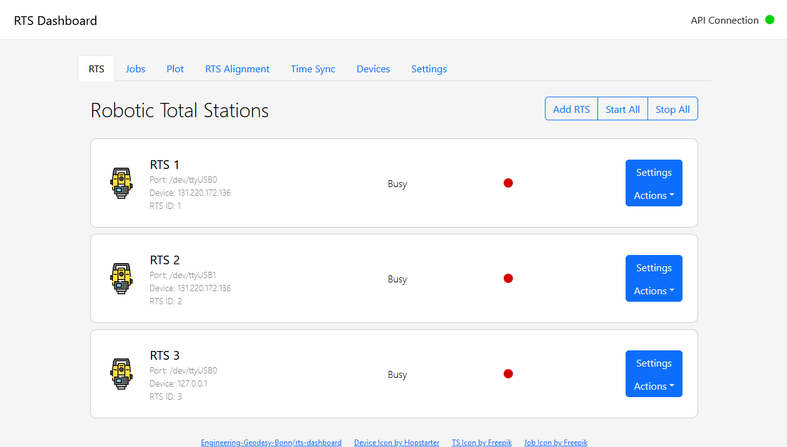

# Robotic Total Station Dashboard

This is the frontend component of the RTS Network project. It is a dashboard web application that allows the user to control the robotic total stations and view the data they collect. It also supports visual time sync and alignment analysis. The dashboard is built using the Dash web framework for Python.




## Installation

Installation is recommended using Docker. The following steps will guide you through the installation process.

1. Clone the repository

```bash
git clone https://github.com/Engineering-Geodesy-Bonn/rts-network
```

2. Build and run the Docker container

```bash
cd rts-dashboard
docker-compose up -d
```

The dashboard will be available at `http://localhost:8050`.

### Manual Installation

If you prefer to install the dashboard manually, you can do so by following these steps:

1. Clone the repository

```bash
git clone https://github.com/Engineering-Geodesy-Bonn/rts-network
```

2. Install the required Python packages

```bash
cd rts-dashboard
pip install -r requirements.txt
```

3. Run the dashboard

```bash
python ./main.py
```
